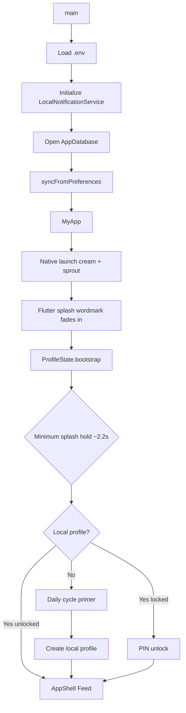
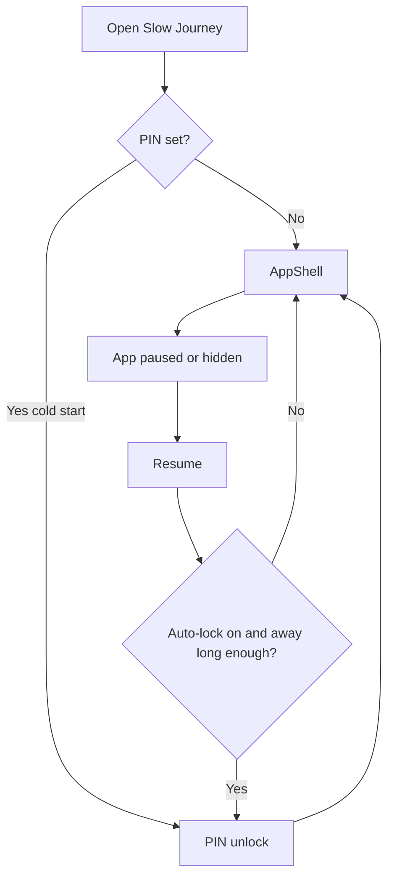
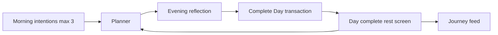
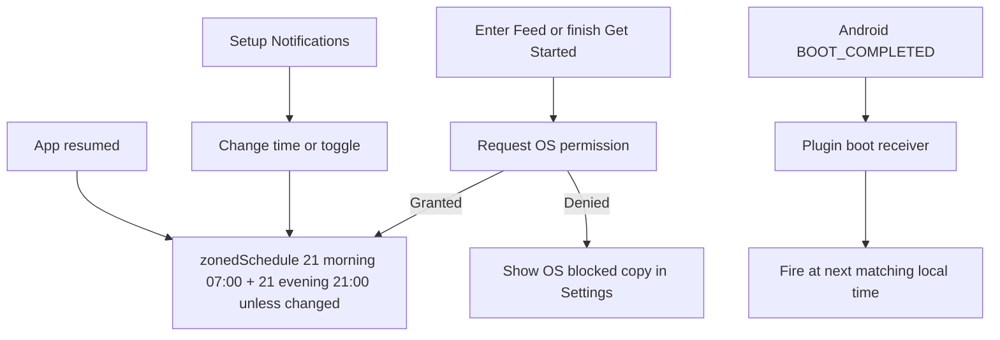

# App flows

## 1. Startup

```mermaid
flowchart TD
  start[main] --> env[Load .env]
  env --> notif[Initialize LocalNotificationService]
  notif --> db[Open AppDatabase]
  db --> syncRem[syncFromPreferences]
  syncRem --> app[MyApp]
  app --> native[Native launch cream + sprout]
  native --> splash[Flutter splash wordmark fades in]
  splash --> boot[ProfileState.bootstrap]
  boot --> hold{Minimum splash hold ~2.2s}
  hold --> none{Local profile?}
  none -->|No| cycle[Daily cycle primer]
  none -->|Yes locked| pin[PIN unlock]
  none -->|Yes unlocked| shell[AppShell Feed]
  cycle --> welcome[Create local profile]
  welcome --> shell
  pin --> shell
```

## 4. PIN and auto-lock

```mermaid
flowchart TD
  open[Open Slow Journey] --> pinSet{PIN set?}
  pinSet -->|No| shell[AppShell]
  pinSet -->|Yes cold start| unlock[PIN unlock]
  unlock --> shell
  shell --> leave[App paused or hidden]
  leave --> back[Resume]
  back --> auto{Auto-lock on and away long enough?}
  auto -->|No| shell
  auto -->|Yes| unlock
```

## 2. Daily loop

```mermaid
flowchart LR
  morning[Morning intentions max 3] --> planner[Planner week or month]
  planner --> evening[Evening reflection]
  evening --> complete[Complete Day transaction]
  complete --> rest[Day complete rest screen]
  rest --> feed[Journey feed]
  rest --> planner[Planner]
```

## 3. Reminders

```mermaid
flowchart TD
  enter[Enter Feed or finish Get Started] --> perm[Request OS permission]
  perm -->|Granted| sched[zonedSchedule 21 morning 07:00 + 21 evening 21:00 unless changed]
  perm -->|Denied| blocked[Show OS blocked copy in Settings]
  setup[Setup Notifications] --> change[Change time or toggle]
  change --> sched
  resume[App resumed] --> sched
  boot[Android BOOT_COMPLETED] --> plugin[Plugin boot receiver]
  plugin --> fire[Fire at next matching local time]
```
