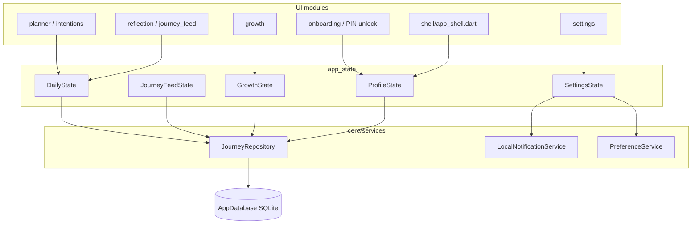

# Code structure

How folders in `lib/` map onto the daily loop.

| Screen area | State | Service | Tables |
|-------------|-------|---------|--------|
| Onboarding / PIN | `ProfileState` | `JourneyRepository` | `profile` |
| Intentions / planner | `DailyState` | `JourneyRepository` | `intention` |
| Evening ritual | `DailyState` | `JourneyRepository` | `reflection`, `key_learning`, `usage_counter` |
| Feed | `JourneyFeedState` | `JourneyRepository` | `reflection` |
| Growth | `GrowthState` | `JourneyRepository` | `usage_counter`, `learning_tag_count`, `insight` |
| Reminders | `SettingsState` | `LocalNotificationService` | SharedPreferences (not SQLite) |
